
 

## Modelo de análisis de datos para la región Caribe
#### Proyecto final de análisis de datos 
#### Nivel Integrador

## Índice
1. [Introducción](#section1)
2. [Objetivos](#section2)
3. [Justificación](#section3)
4. [Métodos](#section4)
5. [Implementación de la Solución](#section5)
6. [Conclusiones](#section6)
7. [Referencias](#section7)

## INTRODUCCIÓN

La transición energética se ha convertido en un pilar fundamental para enfrentar los retos del cambio climático y promover un desarrollo sostenible. En Colombia, la región Caribe posee un alto potencial para el uso de energías limpias debido a su potencial ubicación geográfica para el uso de vientos y la radiación solar, pero enfrenta importantes desafíos en términos de desigualdad en el acceso a la energía, falta de infraestructura y dependencia de fuentes energéticas convencionales.

La región Caribe ha enfrentado altos costos logísticos debido a su gran dependencia de plantas térmicas (de gas, carbón y combustible líquido), las cuales presentan costos energéticos superiores en comparación con las energías renovables. Estas últimas, hasta el momento, no han
alcanzado una generación significativa para la región, lo que incrementa los costos de servicios públicos para las familias locales. [DNP](https://www.dnp.gov.co/Prensa_/Noticias/Paginas/dnp-el-caribe-es-clave-para-la-modernizacion-de-la-infraestructura-y-la-transicion-energetica-del-pais.aspx).

Este proyecto busca contribuir a la transición energética justa y sostenible en la región Caribe, facilitando la democratización del acceso a la energía mediante un modelo de análisis de datos que permita una planificación y gestión adecuadas de la oferta y demanda energética.

## OBJETIVO GENERAL

Desarrollar un modelo de análisis de datos que permita integrar, procesar y visualizar información sobre la oferta y demanda energética en la región Caribe colombiana, utilizando técnicas de modelado predictivo, como gradient boosting y Prophet, con el fin de proponer soluciones y recomendaciones prácticas para una transición energética justa y sostenible entre el 2025 y el 2030.

## Objetivos Específicos

- Identificar y recopilar los datos relevantes sobre oferta y demanda energética en la región Caribe a partir de fuentes confiables, especialmente mediante el uso del API de Sinergox.

- Emplear técnicas avanzadas de integración y filtrado de datos en Python que permitan un análisis detallado de la generación y el consumo energético en la región.

- Aplicar modelos de predicción, como gradient boosting y Prophet, para proyectar el comportamiento de las variables de oferta y demanda energética en el periodo de 2025 a 2030.

- Visualizar los resultados del análisis mediante gráficos interactivos y tableros, facilitando la comprensión de tendencias y la toma de decisiones estratégicas para la transición
energética en la región Caribe.

## JUSTIFICACIÓN

El desarrollo de un modelo de análisis de datos para la transición energética en la región Caribe colombiana es de vital importancia para fomentar una democratización efectiva en el acceso y consumo energético. A través de técnicas avanzadas de análisis de datos y modelos predictivos, este proyecto se propone ofrecer una herramienta práctica que permita anticipar el comportamiento de la demanda y oferta energética en los próximos años. De esta manera, se contribuirá a la formulación de políticas y estrategias que impulsen el uso de energías renovables, apoyen el desarrollo de comunidades energéticas y fortalezcan la transición hacia una economía más limpia y justa. Además, este proyecto tiene la capacidad de convertirse en una referencia para futuras investigaciones y proyectos de transición energética en otras regiones del país.

## MÉTODOS

### Recolección de datos

Se evaluaron varios portales de datos abiertos y se identificó el portal
https://www.xm.com.co/, donde se descargaron una serie de archivos en formato CSV. A partir de estos, se construyó un modelo relacional en Workbench con las estructuras de datos necesarias para almacenar la información. Sin embargo, al realizar un análisis exploratorio inicial, se detectó que el volumen de datos recopilado es bajo y que requiere un esfuerzo adicional, manual y poco eficiente, para alimentar la base de datos y cumplir con los objetivos del análisis.

Continuando con la búsqueda de fuentes de datos, se encontró en el mismo portal de XM un sitio dedicado a la analítica de datos e inteligencia de negocios, SINERGOX sinergox.xm.com.co, donde está disponible el API XM, que contiene información relevante sobre el Mercado de Energía Mayorista Colombiano. Esta API puede utilizarse en Python y está disponible en la [API_XM](https://github.com/EquipoAnaliticaXM/API_XM).

### Descripción de datos

Para obtener el listado de métricas disponibles, se debe importar la librería pydataxm, la cual fue instalada previamente mediante el comando pip install pydataxm. A continuación, se presenta el proceso realizado:

**1- Instalación de la librería**

    #pip install `pydataxm`

- Importación de librerías

**2- Se realiza la importación de las librerías necesarias para ejecutar**

from `pydataxm` import *

**3- Se importa la clase que invoca el servicio**

import `datetime` as `dt`

from `pydataxm.pydataxm` import ReadDB as `apiXM`

**4- Se almacena el servicio en el nombre objetoAPI**

`objetoAPI` = `pydataxm.ReadDB()`

**5- Se indica el objeto que contiene el servicio**

**6- Se indica el nombre de la métrica tal como se llama en el campo ``metricID``**

**7- Campo numérico indicando el nivel de desagregación, 0 para valores del Sistema**

**8- Corresponde a la fecha inicial**
**9- Corresponde a la fecha fin de la consulta**
- `df = apiXM.request_data(pydataxm.ReadDB()`,
- "ListadoMetricas",
    `dt.date(2021, 1, 1),`
    `dt.date(2021, 1, 10))`

**Las variables utilizadas para obtener los datos de la demanda fueron:**

Nombre de Métrica: Demanda Comercial
Valor de Métrica : DemaCome y Dema Real

**Las variables utilizadas para obtener los datos de la oferta fueron:**

Nombre de Métrica: Gene
Valor de Métrica : Recurso
Recurso por centrales energéticas:

Los recursos fueron clasificados según la locación y la región a la que pertenecen. Los recursos analizados correspondían a los generadores normales que representaban la mayor generación energética del país y se construyó una base de datos Recursos.xlsx. Las regiones se clasificaron según la Distribución geográfica por Departamentos y Regiones
del artículo 45 de la ley 2056 de 2020:

## Distribución de las Regiones en Colombia. Tomado de MinTIC.

### Limpieza y preparación de datos

Se realiza la revisión de la información consultada, la cual devuelve los valores de demanda diaria por región. Los datos están completos y sin valores nulos.

El formato de fecha es `YYYY-MM-DD`

Se decide filtrar los datos por la región específica del caribe que corresponde al objeto de estudio.

**- Definir la región específica a seleccionar**

`regiones_especificas = ['CARIBE MAR', 'CARIBE SOL']`

Así mismo, se filtran los datos para los años 2021, 2022 y 2023 desde el 01/01/2021 hasta 31/12/2023,, y se realiza el cálculo adicional para obtener el valor de la demanda diaria y valor de demanda mensual.

**- Librerías utilizadas**

`import streamlit`
`mport matplotlib.pyplot`
`import matplotlib.dates`
`import plotly.express`
`import plotly.graph_objects`
`import datetime`
`import numpy`
`import pandas`

**- Herramientas utilizadas:**

Visual Studio Code
Jupyter Notebook
GitHub
Streamlit
API XM

### Justificación de las decisiones metodológicas

- Respecto a la fuente de datos, se optó por utilizar la API XML, ya que permite acceder a un mayor volumen de datos, lo cual facilita los análisis y la implementación del modelo de predicción.

- En este caso de estudio, no fue posible realizar una regresión lineal, ya que los resultados mostraron que los datos no siguen una tendencia lineal. Por lo tanto, fue necesario aplicar otro modelo predictivo. Ante esta situación, se realizaron una serie de pruebas para determinar el modelo no lineal más adecuado. Aunque el modelo de gradient boosting resultó ser una opción viable, no alcanzó la precisión requerida. Por esta razón, se decidió emplear el modelo Prophet, que mostró una tendencia de incremento en la demanda futura.

## IMPLEMENTACIÓN DE LA SOLUCIÓN

### Análisis Exploratorio de Datos (EDA) y selección de Métodos de Análisis

Durante nuestra investigación, realizamos una búsqueda de datos sobre oferta y demanda en la región del Caribe. Inicialmente, utilizamos los datos publicados por los administradores del mercado eléctrico en Colombia, XM S.A. E.S.P. Accedimos a una serie de archivos CSV, que permitieron un primer análisis exploratorio, utilizando el IDE Workbench e integrando Visual Studio Code para manipulación de datos mediante Python. Sin embargo, enfrentamos varios problemas debido al gran volumen de datos, lo cual nos limitaría, ya que tendríamos que alimentar la base de datos manualmente si se deseaba agregar más períodos o variables.

Para resolver este problema, implementamos la API proporcionada por el administrador XM a través de su portal web sinergox.xm.com.co. Esto nos permitió integrar los datos directamente desde Visual Studio Code, instalando la librería pydataxm.

Para el análisis exploratorio, consideramos únicamente los datos correspondientes al período del 01/01/2021 al 31/12/2023. No obstante, dejamos en el código la opción de modificar el intervalo de tiempo según los requerimientos. La API nos proporciona valores por hora para
oferta y demanda; por lo tanto, los agrupamos en valores diarios, obteniendo así 1095 datos, que corresponden a cada día dentro del período seleccionado.

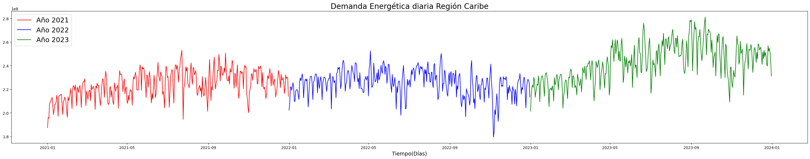
Ver Gráfica en [Jupyter/demanda3.ipynb](Jupyter/demanda3.ipynb)

Como se esperaba inicialmente, la tendencia de la demanda energética tiende a crecer.
Además, el aumento en la demanda podría estar relacionado con la reactivación económica
posterior a la pandemia. Esto podría explicar la disminución en la demanda general durante los
meses de diciembre y enero, que en Colombia coinciden con las vacaciones, periodo en el cual los sectores industriales en general presentan menor actividad. Sin embargo, aunque este análisis no permite concluir una relación fuerte entre la demanda energética y el sector industrial, se sugiere dejar este planteamiento para investigaciones futuras.

Para el caso de la oferta, se realizó el mismo proceso que la demanda, definiendo el mismo
periodo y agrupando los datos diarios en un resultado de oferta total por día.

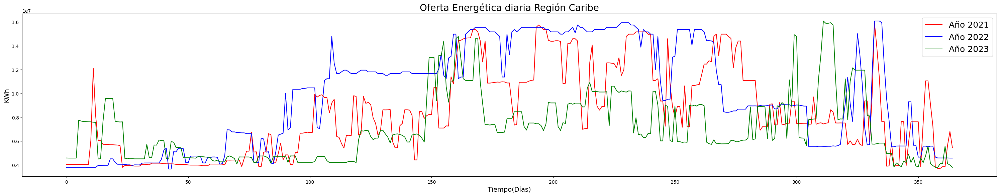
ver Gráfica en [Jupyter/oferta.ipynb](Jupyter/oferta.ipynb)

Por otro lado, la oferta energética presenta un incremento similar al de la demanda, pero muestra menos variabilidad. Esto se debe a la capacidad mínima y máxima de generación de cada central, cuyos valores no tienden a fluctuar tanto como los de la demanda. Se observa, además, que los picos más bajos en la generación coinciden con los periodos de sequía en la región. Aunque la generación térmica representa sólo el 17.5% de la oferta total, esta fuente sigue siendo la principal en la región Caribe, alcanzando una presencia del 82.5%:

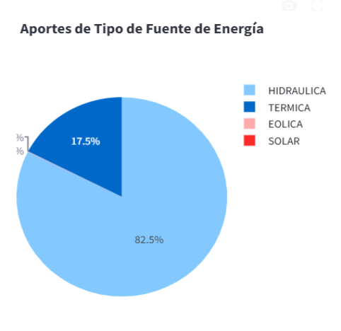
ver gráfico en Dashboard [streamlit](https://demanda-z4civg7fvvjxde57l9uzkt.streamlit.app/)

Entre los años 2021 y 2023, las energías alternativas, como la solar y la eólica, no representan una oferta significativa para la región Caribe. Sin embargo, a nivel nacional, es en esta región donde se encuentran las principales centrales de energías renovables:

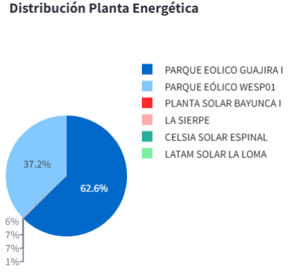 
ver gráfico en Dashboard [streamlit](https://demanda-z4civg7fvvjxde57l9uzkt.streamlit.app/)

Definición del modelo:

Como se planteó en los objetivos de este proyecto, nuestra finalidad es desarrollar un modelo que, mediante el análisis de la relación entre la oferta y la demanda energética de los años 2021, 2022 y 2023, permita predecir el comportamiento de la demanda y la oferta para la región en estudio. Con este propósito, se busca implementar un modelo de regresión que relacione los datos de la forma más precisa posible. En síntesis, el modelo pretende encontrar una relación entre la demanda actual y factores como la oferta, las tendencias históricas y las variaciones recientes.

Inicialmente, se plantea un modelo de regresión lineal, entrenándolo para evaluar su precisión en comparación con los valores reales. Sin embargo, los resultados obtenidos con este modelo no han sido los esperados:

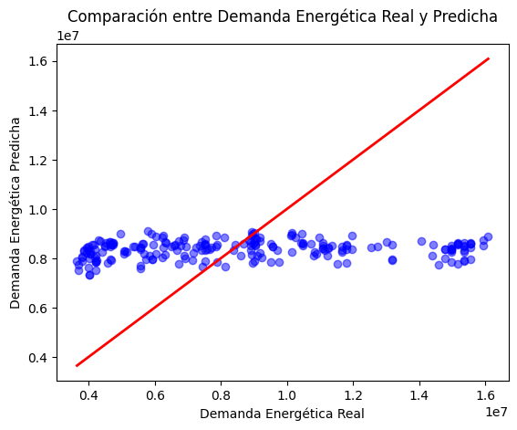
ver Gráfica en [Jupyter/regresionLineal.ipynb](Jupyter/regresionLineal.ipynb)

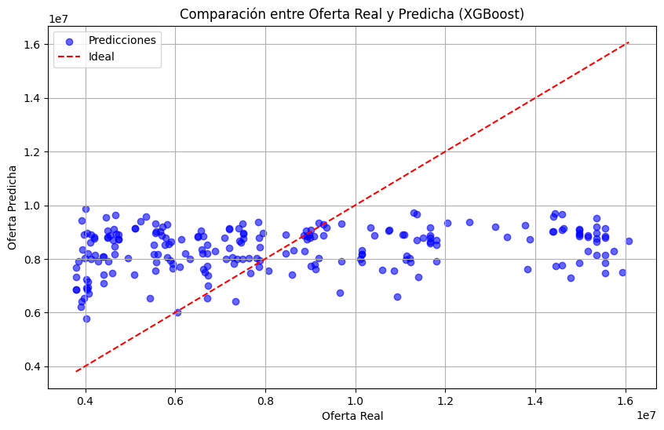
ver Gráfica en [Jupyter/regresionLineal.ipynb](Jupyter/regresionLineal.ipynb)

Como se observa en las gráficas, el modelo de regresión lineal no se ajusta adecuadamente a los datos reales. Por esta razón, se decidió utilizar Python para evaluar distintos modelos de regresión con el fin de identificar aquellos que mejor se aproximen a los datos esperados. Para ello, se empleó la librería de Python scikit-learn para evaluar distintos modelos mediante funciones, es decir, esta librería nos permite ejecutar distintos modelos de predicción y con los resultados obtenidos se compara para cada uno el coeficiente de determinación (R2) mientras más cercano a 1 mejor, también tenemos el error cuadrático medio (MSE) y el error absoluto medio (MAE) buscando en cada uno que sean lo más pequeños posible.

Llegados a este punto se encontró un problema, y es que los valores de demanda y oferta son muy diferentes en comportamiento y no siempre dependen de los mismos factores, por lo cual se decide comparar distintos modelos en cada uno por separado buscando el que presente unos mejores resultados.

Por medio de lo anterior, se obtuvieron los siguientes valores para la demanda en cada función evaluada:

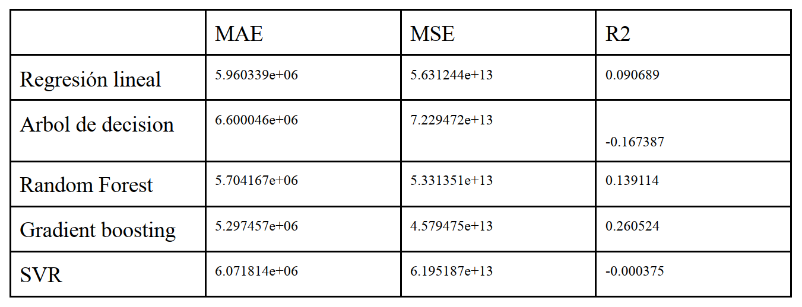
ver resultados en [Jupyter/regresionLineal.ipynb](Jupyter/regresionLineal.ipynb)

Se observa que el método de potenciación del gradiente (gradient boosting) es el que ofrece los mejores resultados. Sin embargo, estos pueden mejorarse aún más. Dado que es un modelo basado en árboles de decisión, es posible entrenarlo aumentando la profundidad de los árboles, añadiendo más estimadores y, así, mejorar su precisión.

Dado que se trata de un modelo de árboles de decisión, se modifican los hiperparametros tales como la profundidad del modelo o el ratio de aprendizaje, se ejecuta un ciclo hasta encontrar aquellos valores que ofrezcan los resultados más óptimos y se realiza nuevamente la evaluación del modelo.

`MAE: 728967.718857183`
`MSE: 1116382663007.502`
`R2: 0.9819730888126732`

Se ha mejorado significativamente en comparación con los valores iniciales, especialmente el R2, que ahora está muy cerca de 1. Esto indica que el modelo seleccionado ha sido efectivo. A continuación, se presenta la gráfica correspondiente a este modelo:

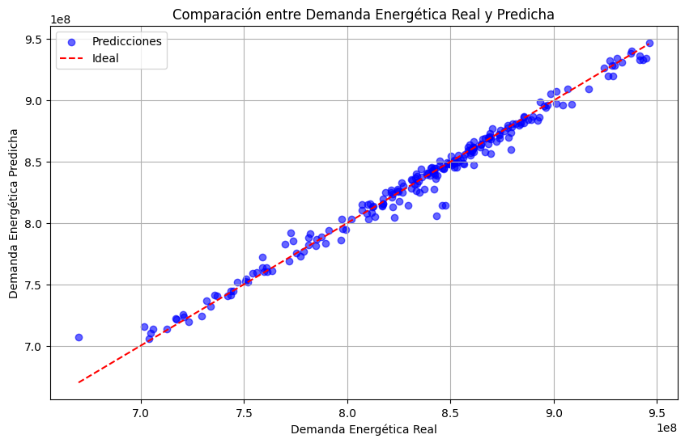
ver Gráfica en [Jupyter/regresionLineal.ipynb](Jupyter/regresionLineal.ipynb)

Como se observa en la gráfica, el modelo arroja unos valores de predicción con margen de error muy bajos, encontrándose además, la tendencia esperada de aumento de la demanda con el tiempo, a diferencia de la gráfica anterior donde la demanda predicha tiene un comportamiento más plano.

Por último, con el fin de mejorar aún más los resultados esperados, se ha decidido utilizar un modelo desarrollado por Facebook, que se puede implementar fácilmente en Python a través de la importación de su propia librería Prophet. Este modelo de predicción presenta mejores

resultados cuando la variable tiempo es relevante, como en nuestro caso, además de estar entrenado en variables estacionales y mostrar una tendencia clara. Por todo esto, se ha decidido evaluar el modelo y analizar los resultados obtenidos.

Del código se obtiene el siguiente resultado como demanda proyectada. Se establece un
punto en una fecha futura como ejemplo; sin embargo, el modelo permite obtener, con buena exactitud, una demanda específica para un periodo futuro determinado:

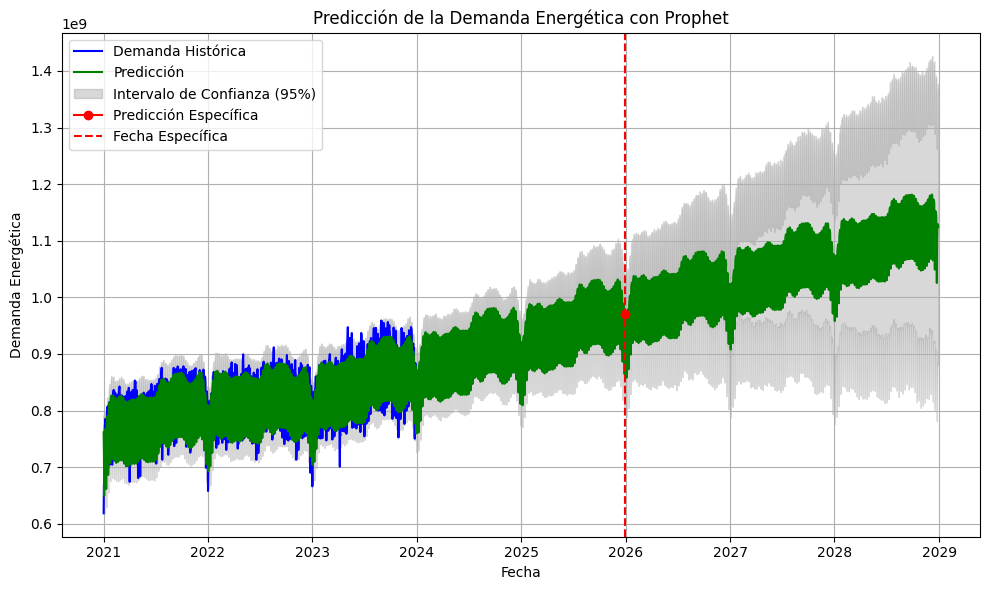
ver Gráfica en [Jupyter/regresionLineal.ipynb](Jupyter/regresionLineal.ipynb)

Se observa que el modelo permite establecer un intervalo de confianza, el cual se interpreta como una zona donde, con un 95% de probabilidad, se encontrará la demanda proyectada. Se puede notar que, a medida que nos alejamos más en el tiempo, este intervalo tiende a crecer, lo que indica que los resultados serán menos precisos.

De los dos modelos ejecutados, se decide continuar la investigación utilizando el modelo Prophet, debido a su fiabilidad y a los valores que proporciona, los cuales nos permiten una mejor comprensión de los resultados obtenidos. Es importante aclarar que estos resultados son aplicables a períodos de corto y mediano plazo, ya que a medida que se extiende el horizonte de estimación a más años, el modelo tiende a ofrecer resultados menos precisos.

Para el caso de la oferta, se evaluaron 3 funciones obteniendo los siguientes parámetros:

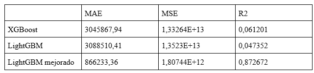

El modelo elegido para este caso, se trata de LightGBM o light gradient boosting machine, este es una implementación del modelo gradient boosting mejorando su capacidad de procesamiento por medio de una mejora en el crecimiento de sus árboles de decisión y su capacidad de operar multinúcleo:

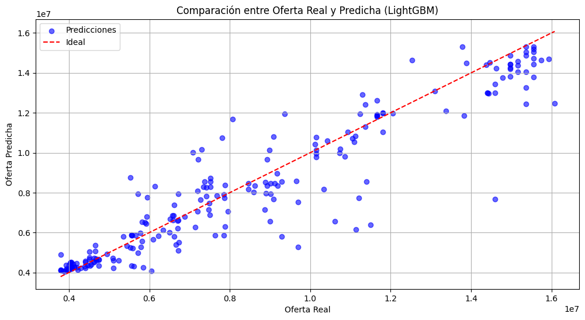
ver Gráfica en [Jupyter/regresionLineal.ipynb](Jupyter/regresionLineal.ipynb)

Al realizar una serie temporal basada en este modelo se grafica y se observa una gran cantidad de ruido en la información obtenida:

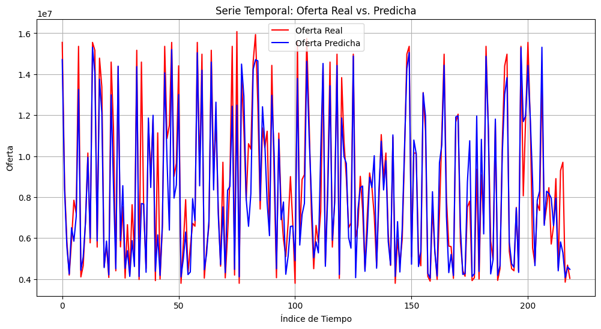
ver Gráfica en [Jupyter/regresionLineal.ipynb](Jupyter/regresionLineal.ipynb)

Por esta razón, y para suavizar los datos obtenidos se implementa un método estadístico robusto que permita realizar un suavizado exponencial a los datos obtenidos e incluir las variables estacionales presentes, se elige el modelo holt winter, y se presenta el siguiente resultado:

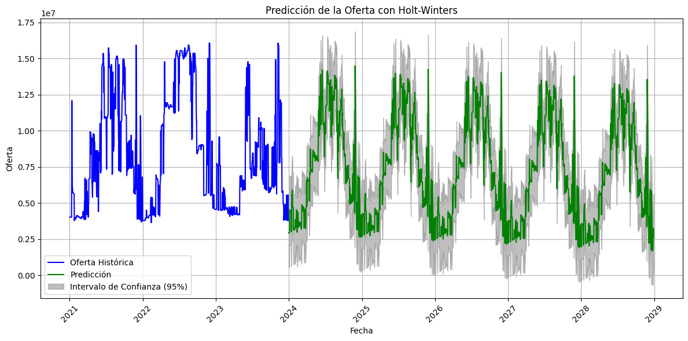
ver Gráfica en [Jupyter/regresionLineal.ipynb](Jupyter/regresionLineal.ipynb)

### CONCLUSIONES

- Este proyecto destaca la relevancia de la transición energética en la región Caribe colombiana, no solo para abordar el cambio climático, sino también para fomentar la equidad en el acceso a la energía. La implementación de un modelo de análisis de datos contribuye a la planificación estratégica necesaria para una transición sostenible y justa en el sector energético.

- A través de la recolección y análisis de datos, se desarrolló un modelo predictivo que utiliza técnicas avanzadas como el gradient boosting y Prophet. Este enfoque permitió anticipar la demanda energética de 2025 a 2030, ofreciendo así una herramienta valiosa para la toma de decisiones políticas y económicas en la región.
El análisis mostró que, aunque varios modelos fueron evaluados, el modelo de gradient boosting demostró ser el más efectivo, logrando un coeficiente de determinación (R²) cercano a 1, lo que indica una alta precisión en las predicciones. Además, la optimización de los hiperparámetros del modelo resultó en una significativa reducción de los errores de predicción, lo cual es esencial para la confianza en las proyecciones realizadas.

- Al igual que con la demanda, la oferta permite mejores resultados en su modelado al considerar métodos de árboles de decisión y suavizado por medio de modelos estacionales, para este caso los modelos usados fueron lightGBM y holt winters, demostrando que los métodos de regresión lineal no son efectivos dado que no consideran variables estacionales.

- Según los datos obtenidos en el modelo para la oferta, no se presentaran grandes cambios en sus valores, a menos que se presenten factores externos no considerados en esta investigación, es decir, ante un gran incremento de la demanda o eventos climáticos de gran impacto, como sequías, se requiere una inversión externa en el sistema para cubrir esta tendencia al alza de la demanda.

- En línea con lo anterior, si bien se tiene que actualmente y a corto plazo la oferta será mayor que la demanda, se deja a consideración el crecimiento más acelerado por parte de la demanda, y como esta podría sobrepasar los niveles de oferta si no se realizan mejoras en el sistema actual, o la implementación de nuevas fuentes de energía en la región de estudio.

- La integración de la API de Sinergox fue clave para acceder a un mayor volumen de datos sobre la oferta y demanda energética. Esto no solo facilitó un análisis más exhaustivo, sino que también permitió automatizar la recolección de datos, reduciendo el esfuerzo manual y aumentando la eficiencia en la obtención de información relevante.

- Valorar la importancia de diversificar la matriz energética del sistema eléctrico colombiano es fundamental para reducir la dependencia de las condiciones hidrológicas al momento de satisfacer la demanda nacional.

- Finalmente, este proyecto abre la puerta a futuras investigaciones en la transición energética en otras regiones de Colombia y en contextos internacionales. La metodología aplicada y los modelos desarrollados pueden ser replicados y adaptados, contribuyendo así a una mayor comprensión y acción sobre el cambio climático y la justicia energética

### REFERENCIAS
- API XM  :   https://github.com/EquipoAnaliticaXM/API_XM
- Gradient boosting: Gradient Boosting con python
- Notas y apuntes del curso análisis de datos integrador.
